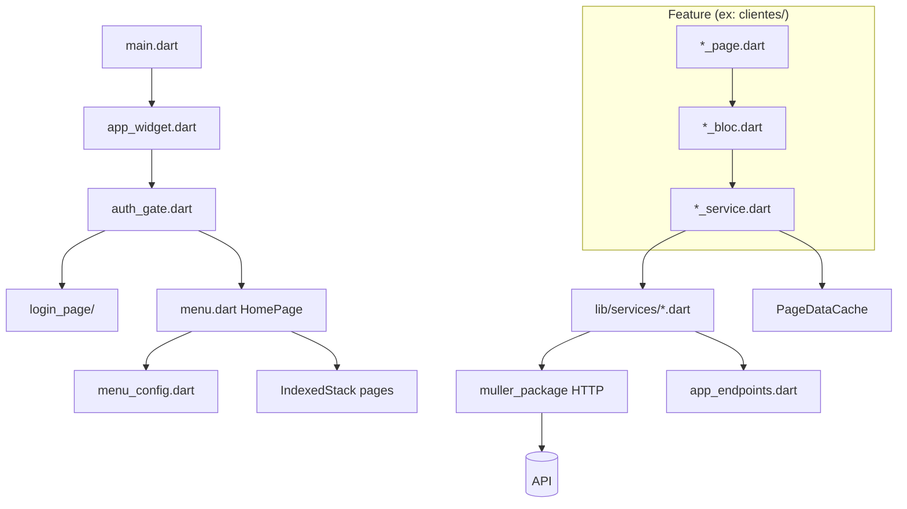

# Template de Projeto Flutter — Muller Package + BLoC

> **Como usar este documento**
>
> Envie este arquivo ao criar um **novo projeto Flutter**. O agente deve seguir **todas** as regras abaixo para gerar a estrutura padrão completa: pastas, arquivos base, dependências, convenções de código e exemplos de feature.
>
> Antes de gerar, substitua os placeholders pelos valores do novo projeto (seção 1).

---

## 1. Placeholders do novo projeto

| Placeholder | Descrição | Exemplo (Convertix) |
|-------------|-----------|---------------------|
| `{{PACKAGE_NAME}}` | Nome do pacote Dart (`pubspec.yaml`) | `web_gestor_site_covertix` |
| `{{APP_TITLE}}` | Título exibido no `MaterialApp` | `Convertix - Gestor Web` |
| `{{BRAND_NAME}}` | Nome da marca (PascalCase) | `Convertix` |
| `{{BRAND_PREFIX}}` | Prefixo camelCase para funções/widgets | `covertix` / `Covertix` |
| `{{API_BASE_URL}}` | URL base da API | `https://api.convertix.net.br` |
| `{{API_PREFIX}}` | Prefixo dos endpoints | `/api/v1` |
| `{{MULLER_PACKAGE_PATH}}` | Caminho do pacote local | `../muller_package` |
| `{{PRIMARY_COLOR}}` | Cor primária da marca (hex) | `0xFF002AFF` |

---

## 2. Princípios gerais (obrigatórios)

| Princípio | Regra |
|-----------|-------|
| **Feature por pasta** | Cada funcionalidade vive em `lib/pages/<area>/<feature>/` com arquivos fixos. |
| **UI não chama API** | A página dispara eventos → BLoC chama service → service faz HTTP. |
| **Pacote = genérico** | Tudo reutilizável entre apps fica no `muller_package`. |
| **Projeto = marca e domínio** | Cores, tabelas admin, botões com identidade visual e validações específicas ficam no app. |
| **StatefulWidget na página** | Formulários, `initState`, `BlocBuilder`/`BlocConsumer` e layout ficam na `*_page.dart`. |
| **BLoC sem BuildContext** | Navegação (`open`), snackbar/toast e persistência são chamados no BLoC via helpers do pacote. |
| **Sem DI framework** | BLoC instanciado na página; services são funções top-level importadas diretamente. |
| **Sem rotas nomeadas** | Navegação via `open()` do pacote + `IndexedStack` no menu + `showDialog` para modais. |
| **Endpoints centralizados** | URLs **nunca** hardcoded em page, BLoC ou service — só em `app_endpoints.dart`. |

---

## 3. Estrutura de pastas a criar

```
{{PACKAGE_NAME}}/
├── lib/
│   ├── main.dart
│   ├── app_config/
│   │   ├── app_widget.dart              # MaterialApp, ThemeData, navigatorKey, home: AuthGate
│   │   ├── auth_gate.dart               # Verifica sessão → HomePage ou LoginPage
│   │   ├── app_auth.dart                # Token/usuário em SharedPreferences
│   │   ├── menu_config.dart             # Itens do menu lateral por perfil
│   │   └── const/
│   │       ├── app_endpoints.dart       # URLs da API
│   │       ├── {{BRAND_PREFIX}}_colors.dart  # Cores exclusivas da marca
│   │       ├── app_theme.dart           # Raio, fontes, tokens locais
│   │       └── panel_header_style.dart  # Estilo de cabeçalhos de painel
│   ├── core/
│   │   └── cache/
│   │       ├── page_data_cache.dart     # Cache TTL em SharedPreferences
│   │       └── cache_keys.dart          # Chaves de cache por entidade
│   ├── models/                          # DTOs da API
│   ├── function/                        # Helpers e validadores do app
│   │   ├── validators.dart
│   │   ├── api_error.dart
│   │   └── http_helper.dart             # Wrappers HTTP (JSON, multipart)
│   ├── services/                        # Camada HTTP fina (getHTTP/postHTTP)
│   ├── pages/
│   │   ├── login_page/                  # Feature standalone (fora do menu)
│   │   │   ├── entrar_page.dart
│   │   │   ├── entrar_bloc.dart
│   │   │   ├── entrar_event.dart
│   │   │   ├── entrar_state.dart
│   │   │   └── entrar_service.dart
│   │   ├── menu.dart                    # HomePage — shell pós-login (menu lateral)
│   │   ├── menu_admin/
│   │   │   ├── inicio/
│   │   │   └── <feature>/               # Uma pasta por feature admin
│   │   └── perfil/                      # Edição do usuário logado
│   └── widgets/                         # Componentes visuais do app (não genéricos)
│       ├── app_elevated_button.dart
│       ├── app_loading.dart
│       ├── app_confirm_dialog.dart
│       ├── app_dialog_header.dart
│       ├── card.dart
│       ├── empty.dart
│       ├── util.dart
│       ├── login/
│       │   └── login_screen_decoration.dart
│       └── table/
│           ├── table.dart
│           ├── table_cell.dart
│           ├── table_header.dart
│           ├── table_layout.dart
│           └── table_breakpoint_scope.dart
├── assets/
│   └── images/
│       ├── logo_texto_fundo_transparente.png
│       └── background.png
├── docs/
│   └── FLUTTER_APP_SCAFFOLD.md          # Este documento
├── web/                                 # index.html, manifest.json (PWA)
└── pubspec.yaml
```

---

## 4. `pubspec.yaml` — dependências padrão

```yaml
name: {{PACKAGE_NAME}}
description: "{{APP_TITLE}}"
publish_to: 'none'
version: 1.0.0+1

environment:
  sdk: ^3.11.5

dependencies:
  muller_package:
    path: {{MULLER_PACKAGE_PATH}}
    # Alternativa Git (produção):
    # git:
    #   url: https://github.com/victormuller55/muller_package.git
    #   ref: main

  flutter:
    sdk: flutter

  bloc: ^8.1.4
  flutter_bloc: ^8.1.6
  shared_preferences: ^2.2.3
  http: ^1.6.0
  http_parser: ^4.1.2
  image_picker: ^1.2.1
  url_launcher: ^6.3.1
  cupertino_icons: ^1.0.8

dev_dependencies:
  flutter_test:
    sdk: flutter
  flutter_lints: ^6.0.0

flutter:
  uses-material-design: true
  assets:
    - assets/images/logo_texto_fundo_transparente.png
    - assets/images/background.png
```

### Monorepo local

```
projects/flutter/
├── muller_package/
└── {{PACKAGE_NAME}}/
```

Use `path: ../muller_package` em desenvolvimento local.

---

## 5. `muller_package` — o que usar e como

### Import padrão (barrel)

```dart
import 'package:muller_package/muller_package.dart';
```

### Import granular (quando necessário)

```dart
import 'package:muller_package/app_consts/app_strings.dart';
import 'package:muller_package/functions/validators.dart';
import 'package:muller_package/app_components/app_snack_bar.dart';
import 'package:muller_package/app_consts/app_context.dart';
```

### O que fica no pacote (usar diretamente)

| Categoria | Símbolos |
|-----------|----------|
| **Layout** | `scaffold`, `appContainer`, `appSizedBox`, `appText`, `appTextButton`, `appLoading` |
| **Formulário** | `AppFormField`, `AppFormFormatters` |
| **Botões genéricos** | `appElevatedButtonText` |
| **Design system** | `AppColors`, `AppSpacing`, `AppRadius`, `AppFontSizes`, `AppStrings` |
| **HTTP** | `getHTTP`, `postHTTP`, `putHTTP`, `deleteHTTP`, `AppResponse`, `ApiException` |
| **Erro** | `ErrorModel`, `appError` |
| **Navegação** | `open()`, `AppContext.navigatorKey` |
| **Feedback** | `showSnackbarSuccess`, `showSnackbarWarning`, `showSnackbarError` |
| **Utilitários** | `formataCPF`, `formataCelular`, `formataCNPJ`, `validaEmail`, `validaCPF`, `validateNotEmpty` |

### O que fica no app (`lib/widgets/`)

| Widget | Arquivo | Motivo |
|--------|---------|--------|
| `appElevatedButton{{BRAND_NAME}}` | `app_elevated_button.dart` | Hover, bordas e cores da marca |
| `appElevatedButton{{BRAND_NAME}}Transparent` | `app_elevated_button.dart` | Variante secundária |
| `appLoading{{BRAND_NAME}}` | `app_loading.dart` | Loading com cor primária da marca |
| `AppTable`, `appTableRow` | `table/table.dart` | Tabela admin com paginação e responsividade |
| `cell*`, `cellHeader*` | `table/table_cell.dart`, `table_header.dart` | Células de domínio |
| `buttonAction` | `table/table_cell.dart` | Botão circular de ação |
| `TableBreakpointScope` | `table/table_breakpoint_scope.dart` | Breakpoint de scroll horizontal |
| `card`, `appCardWrap` | `card.dart` | Cards de seção |
| `emptyMessage` | `empty.dart` | Estado vazio |
| `informacao` | `util.dart` | Linha ícone + texto |

### Regra para novos widgets

```
Precisa de {{BRAND_NAME}}Colors ou layout só deste painel?
  ├─ SIM → lib/widgets/
  └─ NÃO → Será usado em outros apps Muller?
        ├─ SIM → muller_package
        └─ NÃO → lib/widgets/
```

### Padrão de extensão do pacote

```dart
// lib/widgets/app_elevated_button.dart
import 'package:muller_package/muller_package.dart';
import 'package:{{PACKAGE_NAME}}/app_config/const/{{BRAND_PREFIX}}_colors.dart' as local;

Widget appElevatedButton{{BRAND_NAME}}({
  required String title,
  required void Function() onTap,
  // ...
}) {
  return appElevatedButtonText(          // ← do muller_package
    title.toUpperCase(),
    color: local.{{BRAND_NAME}}Colors.primary,  // ← cor da marca
    onTap: onTap,
  );
}
```

```dart
// lib/widgets/app_loading.dart
Widget appLoading{{BRAND_NAME}}() {
  return const Center(
    child: CircularProgressIndicator(
      color: {{BRAND_NAME}}Colors.primary,
      strokeWidth: 2.5,
    ),
  );
}
```

---

## 6. Design tokens — duas camadas de cor

| Token | Origem | Quando usar |
|-------|--------|-------------|
| `AppColors.*` | `muller_package` | Cinzas, vermelho de erro, branco — UI neutra |
| `{{BRAND_NAME}}Colors.*` | `lib/app_config/const/{{BRAND_PREFIX}}_colors.dart` | `primary`, `sidebarBackground`, botões da marca |

`AppStrings`, `AppSpacing` e `AppRadius` vêm sempre do pacote.

Tokens locais adicionais em `app_theme.dart`:

```dart
class AppTheme {
  static const double radiusInput = 12;
  static const double radiusCard = 16;
  static const Duration buttonHoverDuration = Duration(milliseconds: 200);
  static TextTheme get textTheme { /* fontFamily: Segoe UI */ }
}
```

---

## 7. Gerenciamento de estado — BLoC

### Pacotes

- `bloc: ^8.1.4`
- `flutter_bloc: ^8.1.6`

**Não usar:** Provider, GetX, Riverpod, `BlocProvider` na árvore de widgets.

### Arquivos por feature (5 obrigatórios)

| Arquivo | Responsabilidade |
|---------|------------------|
| `<feature>_page.dart` | UI (`StatefulWidget`), formulários, `BlocBuilder`/`BlocConsumer` |
| `<feature>_bloc.dart` | Handlers `on<Event>`, emite estados, chama services, efeitos colaterais |
| `<feature>_event.dart` | Ações da UI (`Load`, `Save`, `Delete`) |
| `<feature>_state.dart` | `Initial`, `Loading`, `Success`, `Error` (+ variantes save/delete) |
| `<feature>_service.dart` | Orquestração de domínio (cache, parse JSON → models) |

Arquivo opcional: `<feature>_cadastro.dart` — formulário de criação/edição.

### Convenção de nomes

Prefixo da feature em PascalCase + sufixo do papel:

```
EntrarBloc / EntrarLoginEvent / EntrarLoadingState       → login
ClientesBloc / ClientesLoadEvent / ClientesSuccessState  → clientes
UsuariosBloc / UsuariosSaveEvent / UsuariosErrorState    → usuários
```

### Instanciação manual do BLoC

```dart
class _ClientesPageState extends State<ClientesPage> {
  final ClientesBloc bloc = ClientesBloc();

  @override
  void initState() {
    super.initState();
    bloc.add(ClientesLoadEvent());
  }

  @override
  void dispose() {
    _formSearch.controller.dispose();
    _clientesNotifier.dispose();
    bloc.close();
    super.dispose();
  }
}
```

### Event (`*_event.dart`)

```dart
abstract class ClientesEvent {}

class ClientesLoadEvent extends ClientesEvent {
  final bool forceRefresh;
  ClientesLoadEvent({this.forceRefresh = false});
}

class ClientesSaveEvent extends ClientesEvent {
  final ClienteModel cliente;
  ClientesSaveEvent({required this.cliente});
}

class ClientesDeleteEvent extends ClientesEvent {
  final int id;
  ClientesDeleteEvent({required this.id});
}
```

### State (`*_state.dart`)

Estados **sem** classe base (admin) ou **com** base (login):

```dart
// Admin — estados independentes
abstract class ClientesState {}
class ClientesInitialState extends ClientesState {}
class ClientesLoadingState extends ClientesState {}
class ClientesSuccessState extends ClientesState {
  final List<ClienteModel> clientes;
  ClientesSuccessState({required this.clientes});
}
class ClientesErrorState extends ClientesState {
  final ErrorModel errorModel;
  ClientesErrorState({required this.errorModel});
}
class ClientesSaveSuccessState extends ClientesState {}
class ClientesDeleteSuccessState extends ClientesState {}
```

### Bloc (`*_bloc.dart`)

```dart
class ClientesBloc extends Bloc<ClientesEvent, ClientesState> {
  ClientesBloc() : super(ClientesInitialState()) {
    on<ClientesLoadEvent>((event, emit) async {
      emit(ClientesLoadingState());
      try {
        final clientes = await listarClientes(forceRefresh: event.forceRefresh);
        emit(ClientesSuccessState(clientes: clientes));
      } catch (e) {
        emit(ClientesErrorState(errorModel: errorModelFromException(e)));
      }
    });
    // SaveEvent, DeleteEvent...
  }
}
```

### Page (`*_page.dart`) — esqueleto

```dart
class FeaturePage extends StatefulWidget {
  const FeaturePage({super.key});
  @override
  State<FeaturePage> createState() => _FeaturePageState();
}

class _FeaturePageState extends State<FeaturePage> {
  final FeatureBloc bloc = FeatureBloc();
  late AppFormField _formSearch;
  final _allItens = <Model>[];
  final _itensNotifier = ValueNotifier<List<Model>>([]);

  @override
  void initState() {
    super.initState();
    _formSearch = AppFormField(
      context: context,
      hint: AppStrings.digiteAlgoParaPesquisar,
      icon: Icon(Icons.search, color: {{BRAND_NAME}}Colors.primary),
      onChange: _search,
    );
    bloc.add(FeatureLoadEvent());
  }

  void _search(String value) {
    final query = value.trim().toLowerCase();
    _itensNotifier.value = query.isEmpty
        ? _allItens
        : _allItens.where((e) => e.nome.toLowerCase().contains(query)).toList();
  }

  Widget _bodyBuilder() {
    return BlocConsumer<FeatureBloc, FeatureState>(
      bloc: bloc,
      listener: (context, state) {
        if (state is FeatureSaveSuccessState) {
          showToastSuccess(message: 'Salvo com sucesso');
          bloc.add(FeatureLoadEvent(forceRefresh: true));
        }
      },
      builder: (context, state) {
        if (state is FeatureLoadingState) return appLoading{{BRAND_NAME}}();
        if (state is FeatureErrorState) {
          return appError(state.errorModel, function: () => bloc.add(FeatureLoadEvent()));
        }
        if (state is FeatureSuccessState) {
          _allItens
            ..clear()
            ..addAll(state.itens);
          _itensNotifier.value = List.from(_allItens);
        }
        return _body();
      },
    );
  }

  @override
  Widget build(BuildContext context) {
    return scaffold(
      title: 'Título',
      hideBackIcon: true,
      appBarColor: {{BRAND_NAME}}Colors.surface,
      background: {{BRAND_NAME}}Colors.background,
      body: _bodyBuilder(),
    );
  }
}
```

### Fluxo de dados

```
Page → bloc.add(Event) → Bloc → feature *_service.dart → lib/services/* ou http_helper → API
                              ↓
                         emit(State) → BlocBuilder na Page
```

---

## 8. Camada de services (dupla)

### Camada 1 — `lib/services/` (HTTP fino)

Funções que chamam `getHTTP`/`postHTTP` do `muller_package` com endpoints e headers:

```dart
// lib/services/cliente_service.dart
import 'package:muller_package/muller_package.dart';
import 'package:{{PACKAGE_NAME}}/app_config/app_auth.dart';
import 'package:{{PACKAGE_NAME}}/app_config/const/app_endpoints.dart';

Future<AppResponse> getClientes({int? id, String? query}) async {
  final params = <String, String>{};
  if (id != null) params['id'] = id.toString();
  if (query != null && query.isNotEmpty) params['query'] = query;

  return getHTTP(
    endpoint: AppEndpoints.endpointClientes,
    parameters: params.isEmpty ? null : params,
    headers: await getAuthHeaders(),
  );
}
```

### Camada 2 — `lib/pages/*/<feature>_service.dart` (orquestração)

- Decodifica JSON → models
- Usa cache (`PageDataCache`)
- Invalida cache após mutações
- Usa `http_helper.dart` para JSON/multipart quando necessário

```dart
Future<List<ClienteModel>> listarClientes({bool forceRefresh = false}) async {
  if (!forceRefresh) {
    final cached = await PageDataCache.getJsonList(CacheKeys.clientes);
    if (cached != null) return cached.map(ClienteModel.fromMap).toList();
  }
  final response = await getClientes();
  final list = jsonDecode(response.body) as List;
  final maps = list.map((item) => Map<String, dynamic>.from(item as Map)).toList();
  await PageDataCache.setJsonList(CacheKeys.clientes, maps);
  return maps.map(ClienteModel.fromMap).toList();
}
```

### Camada 3 — `lib/function/http_helper.dart`

Wrappers sobre `package:http` com auth automática, multipart e tratamento de status:

- `getJson`, `postJson`, `putJson`, `patchJson`, `deleteJson`
- `postMultipart`, `putMultipart`
- `parseApiError()` via `api_error.dart`

---

## 9. Cache (`lib/core/cache/`)

```dart
class PageDataCache {
  static const Duration ttl = Duration(minutes: 10);
  // getJsonList, setJsonList, invalidate, clearAll
}

class CacheKeys {
  static const clientes = 'clientes_list';
  static const sites = 'sites_list';
  // uma chave por entidade listável
}
```

- Limpar cache no logout via `PageDataCache.clearAll()` em `app_auth.dart`
- Invalidar chave após create/update/delete

---

## 10. Modelos (`lib/models/`)

### Convenções

- **Sufixo:** `*Model` (ex.: `ClienteModel`, `UsuarioModel`)
- **Campos:** nullable (`int?`, `String?`) — refletem resposta da API
- **Serialização:** `fromMap(Map<String, dynamic>)` manual (sem `json_serializable`)
- **Chaves JSON:** `snake_case` do contrato da API
- **Factory:** `Model.empty()` para formulários novos
- **Payloads:** `toJsonCadastro()`, `toMap()`, etc.

```dart
class ClienteModel {
  int? id;
  String? nomeEmpresa;
  // ...

  factory ClienteModel.empty() => ClienteModel(nomeEmpresa: '', /* ... */);

  ClienteModel.fromMap(Map<String, dynamic> json) {
    id = json['id'];
    nomeEmpresa = json['nome_empresa'];
  }

  Map<String, dynamic> toJsonCadastro() => {
    'nome_empresa': nomeEmpresa ?? '',
  };
}
```

### Enums / constantes (`app_enums.dart`)

```dart
class TipoUsuario {
  static const admin = 'ADMIN';
  static const cliente = 'CLIENTE';
}
```

---

## 11. Configuração do app

### `main.dart`

```dart
import 'package:flutter/material.dart';
import 'package:{{PACKAGE_NAME}}/app_config/app_widget.dart';

void main() {
  runApp(const AppWidget());
}
```

### `app_widget.dart`

```dart
return MaterialApp(
  title: '{{APP_TITLE}}',
  navigatorKey: AppContext.navigatorKey,   // OBRIGATÓRIO para open()
  debugShowCheckedModeBanner: false,
  theme: ThemeData(
    useMaterial3: true,
    colorScheme: ColorScheme.fromSeed(seedColor: {{BRAND_NAME}}Colors.primary),
    scaffoldBackgroundColor: {{BRAND_NAME}}Colors.background,
    fontFamily: 'Segoe UI',
    textTheme: AppTheme.textTheme,
  ),
  home: const AuthGate(),
);
```

### `auth_gate.dart`

Verifica sessão persistida e redireciona:

```dart
// initState → hasSessaoValida()
// loading → appLoading com decoração de login
// sessão válida → HomePage()
// sem sessão → LoginPage()
```

### `app_auth.dart`

| Função | Papel |
|--------|-------|
| `saveToken` / `getToken` / `clearToken` | JWT em SharedPreferences |
| `saveUsuarioLogado` / `getUsuarioLogado` | Dados do usuário serializados |
| `getAuthHeaders()` | `{'Authorization': 'Bearer $token'}` |
| `hasSessaoValida()` | Token + usuário + sessão não expirada |
| `getTipoUsuarioLogado()` | Controle de menu e permissões |

**Sessão expira diariamente** — compara `auth_saved_day` com a data atual.

No logout: `clearToken()` + `PageDataCache.clearAll()`.

### `app_endpoints.dart`

```dart
const String server = '{{API_BASE_URL}}';
const String api = '$server{{API_PREFIX}}';

class AppEndpoints {
  static String endpointLogin = '$api/auth/login';
  static String endpointClientes = '$api/clientes';
  static String endpointClientesNovo = '$api/clientes/novo';
  static String endpointClientesAlterar = '$api/clientes/alterar';
  static String endpointClientesApagar = '$api/clientes/apagar';
  // ...
}
```

### `menu_config.dart`

```dart
class MenuItem {
  final String id;
  final String title;
  final IconData icon;
  final Widget page;
  final List<String> tiposPermitidos;
  final List<String>? requerSiteTiposCliente;

  bool temPermissao(String? tipo, {Set<String> tiposSiteCliente = const {}});
}

class MenuConfig {
  static const List<MenuItem> todosOsItens = [ /* ... */ ];
  static List<MenuItem> getItensParaUsuario(String? tipo, {Set<String> tiposSiteCliente = const {}});
}
```

Telas do painel são **const** em `MenuItem.page` e renderizadas em `HomePage` via `IndexedStack`.

---

## 12. Navegação

| Cenário | Como |
|---------|------|
| Bootstrap | `MaterialApp(home: AuthGate())` |
| Após login | `open(screen: const HomePage(), closePrevious: true)` no BLoC |
| Logout | `clearToken()` + `open(screen: const LoginPage(), closePrevious: true)` |
| Menu interno | `IndexedStack` + `ValueNotifier<int>` em `menu.dart` |
| Cadastro tela cheia | `open(screen: FeatureCadastro(...))` |
| Cadastro modal | `showDialog` + `FeatureCadastro(isDialog: true)` |
| Substituir tela | `open(screen: ..., closePrevious: true)` |

**Não usar:** rotas nomeadas, `GoRouter`, `onGenerateRoute`.

Breakpoint do menu lateral: **900px** — drawer em telas menores.

---

## 13. Padrão de telas de listagem

1. BLoC carrega lista → `SuccessState` com `List<Model>`
2. Página guarda `_allItens` e `_itensNotifier` (`ValueNotifier`) para filtro local
3. Campo de busca `AppFormField` com `onChange` filtra sem nova requisição
4. Tabela `AppTable` + `cellHeader*` + `appTableRow` + `cell*`
5. Loading → `appLoading{{BRAND_NAME}}()`
6. Erro → `appError(errorModel, function: _loadData)`
7. Ações → `PopupMenuButton` (editar / excluir)
8. Permissões → `getTipoUsuarioLogado()` + `MenuConfig`

### Tabela responsiva

- Breakpoint scroll: `tableScrollBreakpoint = 1100` em `table_layout.dart`
- Threshold de colunas: `tableScrollColumnThreshold = 10`
- Abaixo do breakpoint: largura fixa + scroll horizontal
- Acima: colunas com `flex` proporcional
- Paginação: 30 linhas/página

---

## 14. Padrão de telas de cadastro

Arquivo: `<feature>_cadastro.dart`

| Modo | Comportamento |
|------|---------------|
| `isDialog: false` | `scaffold` com `bottomNavigationBar` para botões |
| `isDialog: true` | Sem scaffold; cabeçalho customizado + `Navigator.pop` |

```dart
final _formKey = GlobalKey<FormState>();
late final AppFormField nomeForm;

@override
void initState() {
  nomeForm = AppFormField(
    context: context,
    hint: AppStrings.digiteSeuNome,
    dense: true,
    validator: (v) => validateNotEmpty(v, AppStrings.nome),
  );
}

void _save() {
  if (!_formKey.currentState!.validate()) return;
  bloc.add(FeatureSaveEvent(model: ...));
}
```

Botões: `appElevatedButton{{BRAND_NAME}}` (salvar) + `appElevatedButton{{BRAND_NAME}}Transparent` (cancelar).

---

## 15. Formulários (`AppFormField`)

`AppFormField` **não é** `Widget` — expõe `.formulario` e `.controller`:

```dart
late final AppFormField _emailForm;

_emailForm = AppFormField(
  context: context,
  width: 300,
  radius: AppTheme.radiusInput,
  borderColor: {{BRAND_NAME}}Colors.border,
  hoverBorderColor: {{BRAND_NAME}}Colors.primary,
  icon: Icon(Icons.email, color: {{BRAND_NAME}}Colors.primary),
  hint: AppStrings.digiteSeuEmail,
  showContent: false,                              // senha
  textInputFormatter: AppFormFormatters.cpfFormatter,
  validator: validateEmail,
);

// No build:
_emailForm.formulario

// No dispose:
_emailForm.controller.dispose();
```

---

## 16. Validadores (`lib/function/validators.dart`)

Estenda o pacote sem duplicar lógica:

```dart
import 'package:muller_package/app_consts/app_strings.dart';
import 'package:muller_package/functions/validators.dart';

export 'package:muller_package/functions/util.dart' show validateNotEmpty;
export 'package:muller_package/functions/formatters.dart'
    show formataCPF, formataCelular, formataCNPJ;
export 'package:muller_package/functions/validators.dart' show validaCPF;

String? validateEmail(String? value) {
  if (value == null || value.trim().isEmpty) return 'E-mail é obrigatório';
  if (!validaEmail(value)) return AppStrings.emailInvalido;
  return null;
}
```

---

## 17. Tratamento de erros e feedback

| Situação | Onde | Como |
|----------|------|------|
| Erro de listagem | Página | `appError(state.errorModel, function: _loadData)` |
| Erro inline no login | Página | `errorModel` no `BlocBuilder` |
| Sucesso de save | Cadastro (listener) | toast/snackbar + `Navigator.pop` |
| Sucesso de delete | Listagem (listener) | toast + reload |
| Aviso de validação | Página | `showSnackbarWarning` |

```dart
// lib/function/api_error.dart
ErrorModel errorModelFromException(Object e) {
  if (e is ApiException) { /* parse JSON ou fallback por statusCode */ }
  return ErrorModel.empty();
}
```

No BLoC:

```dart
catch (e) {
  emit(FeatureErrorState(errorModel: errorModelFromException(e)));
}
```

---

## 18. Autenticação e perfis

```
Login (EntrarBloc)
  → loginWeb (service)
  → UsuarioModel.fromMap
  → saveToken + saveUsuarioLogado
  → open(HomePage, closePrevious: true)

AuthGate (bootstrap)
  → hasSessaoValida()
  → HomePage ou LoginPage

HomePage (menu.dart)
  → getUsuarioLogado + getTipoUsuarioLogado
  → MenuConfig.getItensParaUsuario
  → IndexedStack com MenuItem.page

Logout
  → clearToken (limpa cache também)
  → open(LoginPage, closePrevious: true)
```

---

## 19. Imports — ordem sugerida

```dart
// 1. Dart / Flutter
import 'dart:convert';
import 'package:flutter/material.dart';

// 2. Pacotes externos
import 'package:flutter_bloc/flutter_bloc.dart';
import 'package:muller_package/muller_package.dart';

// 3. App — config, models, function, services, core
import 'package:{{PACKAGE_NAME}}/app_config/app_auth.dart';
import 'package:{{PACKAGE_NAME}}/models/cliente_model.dart';

// 4. App — mesma feature
import 'package:{{PACKAGE_NAME}}/pages/menu_admin/clientes/clientes_bloc.dart';
import 'package:{{PACKAGE_NAME}}/pages/menu_admin/clientes/clientes_event.dart';
import 'package:{{PACKAGE_NAME}}/pages/menu_admin/clientes/clientes_state.dart';

// 5. Widgets do projeto
import 'package:{{PACKAGE_NAME}}/widgets/app_elevated_button.dart';
import 'package:{{PACKAGE_NAME}}/widgets/table/table.dart';
```

---

## 20. Checklist — criar novo projeto do zero

1. [ ] `flutter create {{PACKAGE_NAME}}` (ou scaffold manual)
2. [ ] Clonar/configurar `muller_package` como pasta irmã
3. [ ] Configurar `pubspec.yaml` com dependências da seção 4
4. [ ] Criar estrutura de pastas da seção 3
5. [ ] Criar `{{BRAND_PREFIX}}_colors.dart` com paleta da marca
6. [ ] Criar `app_theme.dart`, `app_endpoints.dart`, `app_widget.dart`, `auth_gate.dart`, `app_auth.dart`
7. [ ] Criar `core/cache/` (`page_data_cache.dart`, `cache_keys.dart`)
8. [ ] Criar `function/` (`validators.dart`, `api_error.dart`, `http_helper.dart`)
9. [ ] Criar widgets base: `app_elevated_button.dart`, `app_loading.dart`, `table/`
10. [ ] Criar feature de login (`login_page/` com 5 arquivos BLoC)
11. [ ] Criar `menu.dart` (HomePage) + `menu_config.dart`
12. [ ] Criar feature `inicio/` como dashboard pós-login
13. [ ] Criar `models/usuario_model.dart` + `models/app_enums.dart`
14. [ ] Declarar assets em `pubspec.yaml`
15. [ ] Copiar este documento para `docs/FLUTTER_APP_SCAFFOLD.md`

---

## 21. Checklist — nova feature

1. [ ] Criar pasta `lib/pages/<area>/<feature>/`
2. [ ] `*_page.dart`, `*_bloc.dart`, `*_event.dart`, `*_state.dart`, `*_service.dart`
3. [ ] `*_cadastro.dart` (se CRUD)
4. [ ] Model em `lib/models/` (se necessário)
5. [ ] Service HTTP em `lib/services/` (se necessário)
6. [ ] Endpoints em `app_endpoints.dart`
7. [ ] Chave de cache em `cache_keys.dart` (se listagem cacheável)
8. [ ] Registrar tela em `menu_config.dart` (se item de menu)
9. [ ] Validadores em `function/validators.dart` (se regra nova)
10. [ ] Widget visual novo só em `lib/widgets/` se específico do app
11. [ ] Service autenticado: `headers: await getAuthHeaders()`
12. [ ] Testar fluxo: load → loading → success/error → CRUD

---

## 22. Diagrama de arquitetura



---

## 23. Referência rápida de widgets

### Do `muller_package` (uso direto)

`scaffold` · `appContainer` · `appText` · `appSizedBox` · `appTextButton` · `AppFormField` · `appError` · `appLoading` · `appElevatedButtonText` · `showSnackbar*` · `open` · `formataCPF` · `formataCelular` · `formataCNPJ`

### Do projeto (import explícito)

`appElevatedButton{{BRAND_NAME}}` · `appElevatedButton{{BRAND_NAME}}Transparent` · `appLoading{{BRAND_NAME}}` · `AppTable` · `appTableRow` · `cellHeader*` · `cellName` · `cellText` · `cellAction` · `buttonAction` · `card` · `appCardWrap` · `emptyMessage` · `informacao`

---

## 24. Instruções para o agente de IA

Ao receber este documento para criar um novo projeto:

1. **Pergunte ou infira** os valores da seção 1 (placeholders).
2. **Gere toda a estrutura** da seção 3 com arquivos funcionais (não stubs vazios).
3. **Implemente login completo** como feature de referência (5 arquivos BLoC + model + auth).
4. **Implemente HomePage** com menu lateral, `IndexedStack` e ao menos a tela `inicio/`.
5. **Crie widgets de marca** (`app_elevated_button`, `app_loading`) estendendo o `muller_package`.
6. **Crie tabela admin** em `widgets/table/` (copiar padrão responsivo).
7. **Use exemplos de código** deste documento como base — adapte nomes e endpoints.
8. **Não invente padrões diferentes** — siga BLoC manual, sem DI, sem rotas nomeadas.
9. **Inclua este MD** em `docs/FLUTTER_APP_SCAFFOLD.md` no novo repositório.
10. **Rode `flutter pub get`** e corrija erros de compilação.

---

*Documento consolidado a partir do projeto **web_gestor_site_covertix**, **muller_package** e guias internos `padronizacao-e-estrutura.md` / `estrutura-de-tela.md`.*
